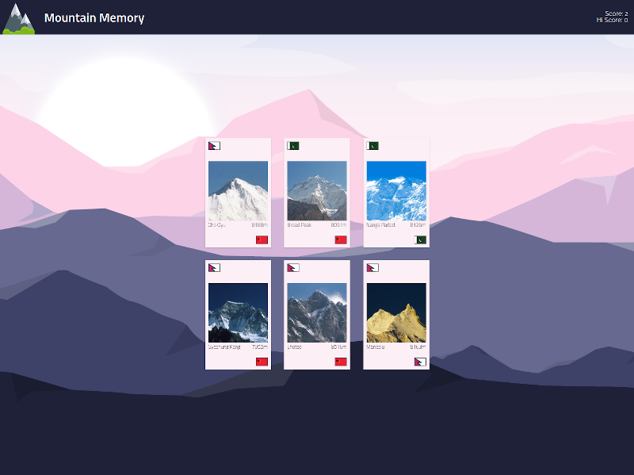

<!--
*** Thanks for checking out the Best-README-Template. If you have a suggestion
*** that would make this better, please fork the repo and create a pull request
*** or simply open an issue with the tag "enhancement".
*** Don't forget to give the project a star!
*** Thanks again! Now go create something AMAZING! :D
-->

<!-- PROJECT SHIELDS -->
<!--
*** I'm using markdown "reference style" links for readability.
*** Reference links are enclosed in brackets [ ] instead of parentheses ( ).
*** See the bottom of this document for the declaration of the reference variables
*** for contributors-url, forks-url, etc. This is an optional, concise syntax you may use.
*** https://www.markdownguide.org/basic-syntax/#reference-style-links
-->

<!-- [![Contributors][contributors-shield]][contributors-url]
[![Forks][forks-shield]][forks-url]
[![Stargazers][stars-shield]][stars-url]
[![Issues][issues-shield]][issues-url]
[![MIT License][license-shield]][license-url] -->

[![LinkedIn][linkedin-shield]][linkedin-url]

<!-- PROJECT LOGO -->
 

  

<h3 align="center">Mountain Memory</h3>

  

    A memory game built in React using functional components and hooks exclusively.
     
    <a href="https://github.com/craigmclean39/memory-game-top"><strong>Explore the docs »</strong></a>
     
     
    <a href="https://github.com/craigmclean39/memory-game-top">View Demo</a>
    ·
    <a href="https://github.com/craigmclean39/memory-game-top/issues">Report Bug</a>
    ·
    <a href="https://github.com/craigmclean39/memory-game-top/issues">Request Feature</a>
  

<!-- TABLE OF CONTENTS -->

  
<h2 style="display: inline-block">Table of Contents</h2>

  <ol>
    <li>
      <a href="#about-the-project">About The Project</a>
      <ul>
        <li><a href="#built-with">Built With</a></li>
        <li><a href="#libraries-used">Libraries Used</a></li>
      </ul>
    </li>
    <li>
      <a href="#getting-started">Getting Started</a>
    </li>
    <li><a href="#features">Features</a></li>
    <li><a href="#contact">Contact</a></li>
    <li><a href="#acknowledgements">Acknowledgements</a></li>
  </ol>

<!-- ABOUT THE PROJECT -->

## About The Project

[![Product Name Screen Shot][product-screenshot]](https://craigmclean39.github.io/memory-game-top/)

This project was part of The Odin Project Full Stack JavaScript curriculum. The purpose of this project was to get more practice with ReactJS as well as utilizing lifecycle methods or hooks. I opted to make this app with all functional components and hooks. I primarily used the useState, useEffect, and useRef hooks. I've also implemented some basic conditional rendering for the game flow.

The game is a basic memory game. The user must select an image from a list of images. After each selection, a new list of images is displayed and they must once again select an image. The goal is to select unique images each time, testing the users memory. Once they select an image they've already selected, the game ends.

The game is fully responsive and plays well on desktop and mobile.

(<a href="#top">back to top</a>)

### Built With

- [JavaScript](https://developer.mozilla.org/en-US/docs/Web/JavaScript)
- [CSS](https://developer.mozilla.org/en-US/docs/Web/CSS)
- [React.js](https://reactjs.org/)

### Libraries Used

- [Uniqid](https://www.npmjs.com/package/uniqid)

(<a href="#top">back to top</a>)

<!-- GETTING STARTED -->

## Getting Started

Take a look at the demo <a href="https://craigmclean39.github.io/memory-game-top/">here.</a>

## Features

- Select one of the displayed mountains. An image of the mountain is displayed along with it's height and flags of the countries where it is located.

- Current score and Hi Score are displayed
- Desktop and mobile support

(<a href="#top">back to top</a>)

<!-- CONTACT -->

## Contact

Craig McLean - craig@craigmclean.dev.com

Project Link: [https://github.com/craigmclean39/memory-game-top](https://github.com/craigmclean39/memory-game-top)

(<a href="#top">back to top</a>)

<!-- ACKNOWLEDGMENTS -->

## Acknowledgments

- [The Odin Project](https://www.theodinproject.com/)
- [Google Fonts](https://fonts.google.com/)

(<a href="#top">back to top</a>)

<!-- MARKDOWN LINKS & IMAGES -->
<!-- https://www.markdownguide.org/basic-syntax/#reference-style-links -->

[linkedin-shield]: https://img.shields.io/badge/-LinkedIn-black.svg?style=for-the-badge&logo=linkedin&colorB=555
[linkedin-url]: https://www.linkedin.com/in/mcleancraig/
[product-screenshot]: ./images/title.png
